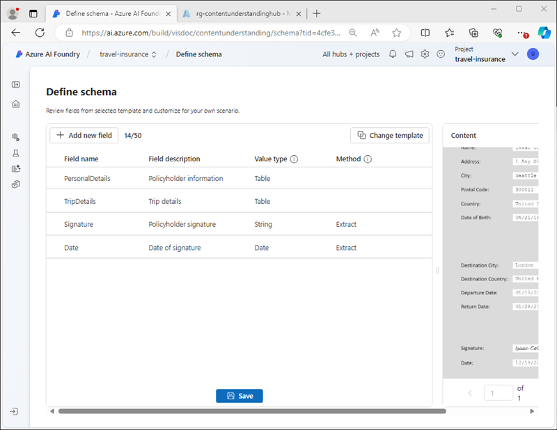

---
lab:
  title: Analysieren von Inhalten mit Azure KI Content Understanding
  module: Multimodal analysis with Content Understanding
---

# Analysieren von Inhalten mit Azure KI Content Understanding

In dieser Übung verwenden Sie das Azure KI Foundry-Portal, um ein Content Understanding-Projekt zu erstellen, das Informationen aus Reiseversicherungsrichtlinienformularen extrahieren kann. Anschließend testen Sie Ihr Inhaltsanalysetool im Azure KI Foundry-Portal und nutzen sie über die REST-Schnittstelle für Content Understanding.

Diese Übung dauert ca. **30** Minuten.

## Erstellen eines Content Understanding-Projekts

Als Erstes erstellen wir ein Content Understanding-Projekt mithilfe des Azure KI Foundry-Portals.

1. Öffnen Sie in einem Webbrowser unter `https://ai.azure.com` das [Azure KI Foundry-Portal](https://ai.azure.com) und melden Sie sich mit Ihren Azure-Anmeldeinformationen an.

    Die Startseite des Azure KI Foundry-Portals sieht ähnlich aus wie das folgende Bild:

    

1. Wählen Sie auf der Startseite im Abschnitt **Schnellsuche** unten die Option **Content Understanding** aus.
1. Klicken Sie auf der Seite **Content Understanding** auf die Schaltfläche **Neues Content Understanding-Projekt erstellen**.
1. Legen Sie im Schritt **Projektübersicht** die folgenden Eigenschaften für Ihr Projekt fest und klicken Sie dann auf **Weiter**:
    - **Projektname**: `travel-insurance`
    - **Beschreibung:** `Insurance policy data extraction`
    - **Hub**: Erstellen eines neuen Hubs
1. Legen Sie im Schritt **Hub erstellen** die folgenden Eigenschaften fest und klicken Sie dann auf **Weiter**:
    - **Azure KI-Hub-Ressource**: `content-understanding-hub`
    - **Azure-Abonnement**: *Wählen Sie Ihr Azure-Abonnement aus.*
    - **Ressourcengruppe**: *Erstellen Sie eine neue Ressourcengruppe mit einem geeigneten Namen.*
    - **Speicherort:** *Wählen Sie einen beliebigen verfügbaren Speicherort aus*
    - **Azure KI Services**: *Erstellen Sie eine neue Azure KI Services-Ressource mit einem geeigneten Namen*
1. Geben Sie im Schritt **Speichereinstellungen** ein neues KI-Hub-Speicherkonto an, und klicken Sie auf **Weiter**.
1. Wählen Sie auf der Seite **Überprüfung** die Option **Projekt erstellen** aus. Warten Sie dann, bis das Projekt und die zugehörigen Ressourcen erstellt werden.

    Wenn das Projekt fertig ist, wird es auf der Seite **Schema definieren** geöffnet.

    

## Überprüfen von Azure-Ressourcen

Wenn Sie den KI-Hub und das Projekt erstellt haben, wurden verschiedene Ressourcen in Ihrem Azure-Abonnement erstellt, um das Projekt zu unterstützen.

1. Öffnen Sie auf einem neuen Tab im Webbrowser unter `https://portal.azure.com` das [Azure-Portal](https://portal.azure.com) und melden Sie sich mit Ihren Azure-Anmeldeinformationen an.
1. Navigieren Sie zu der Ressourcengruppe, die Sie für Ihren Hub erstellt haben, und beachten Sie die erstellten Azure-Ressourcen.

    

## Definieren eines benutzerdefinierten Schemas

Sie erstellen ein Analysetool, das Informationen aus Reiseversicherungsformularen extrahieren kann. Als Erstes definieren Sie ein Schema auf der Grundlage eines Musterformulars.

1. Laden Sie das Musterformular [train-form.pdf](https://github.com/microsoftlearning/mslearn-ai-document-intelligence/raw/main/Labfiles/05-content-understanding/forms/train-form.pdf) von `https://github.com/microsoftlearning/mslearn-ai-document-intelligence/raw/main/Labfiles/05-content-understanding/forms/train-form.pdf` herunter und speichern Sie es in einem lokalen Ordner.
1. Kehren Sie zum Browser-Tab zurück, der Ihr Content Understanding-Projekt enthält, und laden Sie auf der Seite **Schema definieren** die Datei **train-form.pdf** hoch, die Sie gerade heruntergeladen haben.
1. Wählen Sie die Vorlage für **Dokumentanalysen** aus und klicken Sie dann auf **Erstellen**.

    Der Schema-Editor bietet eine Möglichkeit zum Definieren der Datenfelder, die aus dem Formular extrahiert werden sollen. Er wird auf der rechten Seite angezeigt. Der Ordner sieht folgendermaßen aus:

    

    Die Datenfelder im Formular umfassen:
    
    - eine Sammlung von Angaben zur Person des Policeninhabers
    - eine Sammlung von Angaben zu der versicherten Reise
    - Unterschrift und Datum

    Als Erstes fügen wir ein Feld hinzu, das die Angaben zur Person als Tabelle darstellt. Darin definieren wir dann Subfelder für die einzelnen Angaben.

1. Wählen Sie **+ Neues Feld hinzufügen** aus, um ein neues Feld mit den folgenden Werten zu erstellen:
    - **Feldname**: `PersonalDetails`
    - **Feldbeschreibung**: `Policyholder information`
    - **Werttyp**: Tabelle
1. Wählen Sie **Änderungen speichern** (&#10004;) aus und beachten Sie, dass ein neues Subfeld automatisch erstellt wurde.
1. Konfigurieren Sie das neue Subfeld mit den folgenden Werten:
    - **Feldname**: `PolicyholderName`
    - **Feldbeschreibung**: `Policyholder name`
    - **Werttyp**: Zeichenfolge
    - **Methode**: Extrahieren
1. Verwenden Sie die Schaltfläche **+ Neues Subfeld hinzufügen**, um die folgenden weiteren Subfelder hinzuzufügen:

    | Feldname | Feldbeschreibung | Werttyp | Methode |
    |--|--|--|--|
    | `StreetAddress` | `Policyholder address` | String | Extrahieren |
    | `City` | `Policyholder city` | String | Extrahieren |
    | `PostalCode` | `Policyholder post code` | String | Extrahieren |
    | `CountryRegion` | `Policyholder country or region` | String | Extrahieren |
    | `DateOfBirth` | `Policyholder birth date` | Datum | Extrahieren |

1. Wenn Sie alle Subfelder für Angaben zur Person hinzugefügt haben, gelangen Sie über die Schaltfläche **Zurück** wieder zur obersten Ebene des Schemas.
1. Fügen Sie ein neues Feld zur *Tabelle* mit der Bezeichnung **`TripDetails`** hinzu, das die Angaben zur versicherten Reise aufnehmen soll. Fügen Sie diesem Feld dann die folgenden Subfelder hinzu:

    | Feldname | Feldbeschreibung | Werttyp | Methode |
    |--|--|--|--|
    | `DestinationCity` | `Trip city` | String | Extrahieren |
    | `DestinationCountry` | `Trip country or region` | String | Extrahieren |
    | `DepartureDate` | `Date of departure` | Datum | Extrahieren |
    | `ReturnDate` | `Date of return` | Datum | Extrahieren |

1. Kehren Sie zur obersten Ebene des Schemas zurück, und fügen Sie die folgenden zwei einzelnen Felder hinzu:

    | Feldname | Feldbeschreibung | Werttyp | Methode |
    |--|--|--|--|
    | `Signature` | `Policyholder signature` | String | Extrahieren |
    | `Date` | `Date of signature` | Datum | Extrahieren |

1. Vergewissern Sie sich, dass das fertige Schema aussieht wie hier abgebildet, und speichern Sie es.

    

1. Falls die Analyse nicht automatisch beginnt, wählen Sie auf der Seite **Analysetool testen** den Befehl **Analyse ausführen** aus. Warten Sie dann, bis die Analyse abgeschlossen ist, und überprüfen Sie die Textwerte im Formular, die als mit den Feldern im Schema übereinstimmend identifiziert werden.

    

    Der Content Understanding-Service sollte den Text, der den Feldern im Schema entspricht, korrekt identifiziert haben. Andernfalls könnten Sie auf der Seite **Beschriftungsdaten** ein anderes Musterformular hochladen und den richtigen Text für jedes Feld explizit identifizieren.

## Erstellen und Testen eines Analysetools

Nachdem Sie nun ein Modell trainiert haben, um Felder aus Versicherungsformularen zu extrahieren, können Sie ein Analysetool für die Verwendung mit ähnlichen Formularen erstellen.

1. Wählen Sie im Navigationsbereich auf der linken Seite die Seite **Analysetool erstellen** aus.
1. Wählen Sie **+ Analysetool erstellen** aus und erstellen Sie ein neues Analysetool mit den folgenden Eigenschaften (geben Sie sie exakt wie hier abgebildet ein):
    - **Name**: `travel-insurance-analyzer`
    - **Beschreibung:** `Insurance form analyzer`
1. Warten Sie, bis das neue Analysetool bereit ist (Sie können dies mit der Schaltfläche **Aktualisieren** überprüfen).
1. Laden Sie [test-form.pdf](https://github.com/microsoftlearning/mslearn-ai-document-intelligence/raw/main/Labfiles/05-content-understanding/forms/test-form.pdf) von `https://github.com/microsoftlearning/mslearn-ai-document-intelligence/raw/main/Labfiles/05-content-understanding/forms/test-form.pdf` herunter, und speichern Sie die Datei in einem lokalen Ordner.
1. Kehren Sie zur Seite **Analysetool erstellen** zurück, und wählen Sie den Link **Reiseversicherungsanalysetool** aus. Die im Schema des Analysetools definierten Felder werden angezeigt.
1. Wählen Sie auf der Seite **Reiseversicherungsanalysetool** den Befehl **Testen** aus.
1. Verwenden Sie die Schaltfläche **+ Testdateien hochladen**, um **test-form.pdf** hochzuladen, und führen Sie die Analyse aus, um Felddaten aus dem Testformular zu extrahieren.

    

1. Betrachten Sie auf der Registerkarte **Ergebnis** die vom Analysetool ausgegebenen Ergebnisse im JSON-Format an. In der nächsten Aufgabe verwenden Sie die Content Understanding-REST-API, um ein Formular an Ihr Analysetool zu senden und die Ergebnisse in diesem Format zurückzugeben.
1. Schließen Sie die Seite **Reiseversicherungsanalysetool**.

## Verwenden der REST-API für Inhaltsverständnis

Nachdem Sie nun ein Analysetool erstellt haben, können Sie es über die Content Understanding-REST-API in einer Clientanwendung nutzen.

1. Wechseln Sie zum Browser-Tab, der das Azure-Portal enthält (oder öffnen Sie `https://portal.azure.com` in einem neuen Tab, falls Sie die Seite geschlossen haben).
1. Öffnen Sie in der Ressourcengruppe für Ihren Content Understanding-Hub die Ressource **Azure KI Services**.
1. Zeigen Sie auf der Seite **Übersicht** im Bereich **Schlüssel und Endpunkt** die Registerkarte **Content Understanding** an.

    

    Sie benötigen den Content Understanding-Endpunkt und einen der Schlüssel, um von einer Clientanwendung aus eine Verbindung mit Ihrem Analysetool herzustellen.

1. Verwenden Sie die Taste **[\>_]** rechts neben der Suchleiste oben auf der Seite, um eine neue Cloud Shell im Azure-Portal zu erstellen, und wählen Sie eine ***PowerShell***-Umgebung aus. Die Cloud Shell bietet eine Befehlszeilenschnittstelle in einem Bereich am unteren Rand des Azure-Portals, wie hier gezeigt:

    

    > **Hinweis**: Wenn Sie zuvor eine Cloud-Shell erstellt haben, die eine *Bash*-Umgebung verwendet, wechseln Sie zu ***PowerShell***.

1. Beachten Sie, dass Sie die Größe der Cloud-Shell ändern können, indem Sie die Trennlinie oben im Bereich ziehen oder die Symbole **&#8212;**, **&#10530;** und **X** oben rechts im Bereich verwenden, um den Bereich zu minimieren, zu maximieren und zu schließen. Weitere Informationen zur Verwendung von Azure Cloud Shell finden Sie in der [Azure Cloud Shell-Dokumentation](https://docs.microsoft.com/azure/cloud-shell/overview).
1. Wählen Sie in der Cloud Shell-Symbolleiste im Menü **Einstellungen** das Menüelement **Zur klassischen Version wechseln** aus (dies ist für die Verwendung des Code-Editors erforderlich).

1. Geben Sie im PowerShell-Bereich die folgenden Befehle ein, um das GitHub-Repository für diese Übung zu klonen:

    ```
    rm -r mslearn-ai-doc -f
    git clone https://github.com/microsoftlearning/mslearn-ai-document-intelligence mslearn-ai-doc
    ```

1. Navigieren Sie nach dem Klonen des Repositorys zum Ordner **mslearn-ai-doc/Labfiles/05-content-understanding/code**:

    ```
    cd mslearn-ai-doc/Labfiles/05-content-understanding/code
    ```

1. Geben Sie den folgenden Befehl ein, um die bereitgestellte Python-Codedatei **analyze_doc.py** zu bearbeiten:

    ```
    code analyze_doc.py
    ```
    Die Python-Codedatei wird in einem Code-Editor geöffnet:

    

1. Ersetzen Sie in der Codedatei den Platzhalter **\<CONTENT_UNDERSTANDING_ENDPOINT\>** durch Ihren Content Understanding-Endpoint und den Platzhalter **\<CONTENT_UNDERSTANDING_KEY\>** durch einen der Schlüssel für Ihre Azure KI Services-Ressource.

    > **Tipp**: Sie müssen die Größe des Cloud Shell-Fensters ändern oder minimieren, um den Endpunkt und den Schlüssel von der Azure KI Services-Ressourcenseite im Azure-Portal zu kopieren. Achten Sie darauf, die Cloud Shell nicht zu *schließen* (sonst müssten Sie die vorstehenden Schritte wiederholen).

1. Nachdem Sie die Platzhalter ersetzt haben, verwenden Sie den **Befehl STRG+S**, um Ihre Änderungen zu speichern. Überprüfen Sie dann den abgeschlossenen Code, der:
    - eine HTTP POST-Anforderung an Ihren Content Understanding-Endpunkt sendet, in der das **Reiseversicherungsanalysetool** angewiesen wird, ein Formular anhand seiner URL zu analysieren.
    - die Antwort des POST-Vorgangs überprüft, um eine ID für den Analysevorgang abzurufen.
    - wiederholt eine HTTP GET-Anforderung an Ihren Content Understanding-Service sendet, bis der Vorgang nicht mehr ausgeführt wird.
    - Wenn der Vorgang erfolgreich war, wird die JSON-Antwort angezeigt.
1. Verwenden Sie den Tastaturbefehl **STRG+Q**, um den Code-Editor zu schließen, während die Befehlszeile der Cloud Shell geöffnet bleibt.
1. Geben Sie im Befehlszeilenbereich der Cloud Shell den folgenden Befehl ein, um die Python-Bibliothek **requests** zu installieren (die im Code verwendet wird):

    ```
    pip install requests
    ```

1. Geben Sie nach der Installation der Bibliothek im Befehlszeilenbereich der Cloud Shell den folgenden Befehl ein, um den Python-Code auszuführen:

    ```
    python analyze_doc.py
    ```

1. Überprüfen Sie die Ausgabe des Programms, einschließlich der JSON-Ergebnisse der Dokumentenanalyse.

    > **Tipp**: Der Bildschirmpuffer in der Cloud Shell-Konsole ist möglicherweise nicht groß genug, um die gesamte Ausgabe anzuzeigen. Wenn Sie die gesamte Ausgabe überprüfen möchten, führen Sie das Programm mit dem Befehl `python analyze_doc.py > output.txt` aus. Verwenden Sie dann, nachdem das Programm den Vorgang abgeschlossen hat, den Befehl `code output.txt`, um die Ausgabe in einem Code-Editor zu öffnen.

## Bereinigen

Wenn Sie Arbeit mit dem Content Understanding-Service abgeschlossen haben, sollten Sie die in dieser Übung erstellten Ressourcen löschen, um unnötige Azure-Kosten zu vermeiden.

1. Navigieren Sie im Azure KI Foundry-Portal zum Projekt **Reiseversicherung** und löschen Sie es.
1. Löschen Sie im Azure-Portal die Ressourcengruppe, die Sie in dieser Übung erstellt haben.

